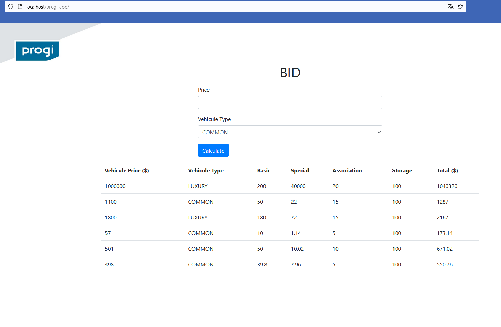

# Tecnologie

Vue.js v2.7.16, SQlite3, php 8

# Test unit

To test some methods using you can use the following file:

```
test.php
```

# Database

The database using is SQLite, this db has data

```
database/
├── bid_calculation_repo.db
```
